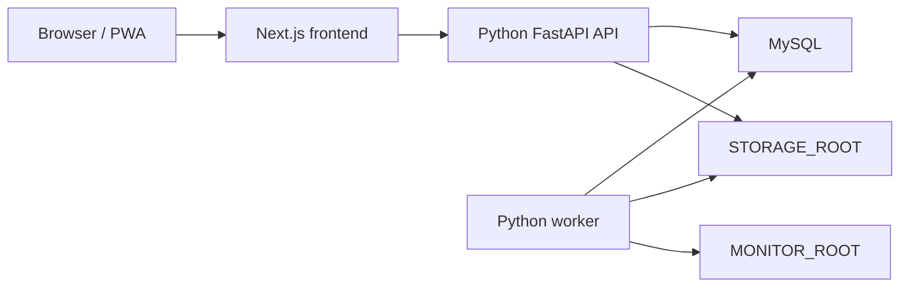

# Python Backend Migration Progress

This document tracks the migration from the historical Node.js/Next.js backend implementation to the Python API and Python worker. Docker runtime paths now use a unified application container that starts Next.js, FastAPI, and the Python worker together.

## Current Node Backend Inventory

- API surface: Next.js App Router routes under `apps/web/app/api`, currently 67 route files and roughly 87 HTTP handlers.
- Web backend libraries: shared TypeScript logic under `apps/web/lib`, including auth, health checks, file responses, backups, source search, downloads, reader preferences, and view mapping.
- Import and organization logic: TypeScript packages under `packages/scanner/src`, including EPUB/CBZ/ZIP import, comic page indexing, cover generation, path safety, metadata suggestions, and organize jobs.
- Worker: Python watchdog worker is the runtime worker. `workers/scan-worker` remains in the repository only for later source cleanup.
- Database: Prisma Client against MySQL, with schema in `packages/database/prisma/schema.prisma`.
- Deployment: Docker Compose runs `web` and `mysql` locally, plus `migrate` in production. The `web` container starts Next.js, FastAPI, and the Python worker.
- Storage: imported files, covers, indexes, temporary files, and logs live under `STORAGE_ROOT`; monitor folders are constrained by `MONITOR_ROOT`.
- Auth: cookie session named `shuku_session`, persisted `Session` rows, SHA-256 token hashes, and scrypt password hashes in `salt:hash` format.

## Target Architecture

- Frontend remains Next.js/React.
- Backend API is Python FastAPI.
- Background importing is the Python worker.
- MySQL remains the system of record.
- Existing `/api/...` paths remain the public contract.
- Unified `/api` routing is permanent: Next.js rewrites `/api/:path*` to the local FastAPI process inside the same container.

## Technology Choices

- API framework: FastAPI, for typed request/response handling and OpenAPI support.
- ASGI server: uvicorn.
- ORM: SQLAlchemy 2.x.
- Migrations: Alembic.
- Configuration: pydantic-settings.
- Validation and serialization: Pydantic v2.
- File and import support: aiofiles, Pillow, ebooklib, lxml, Python stdlib zipfile, and either pypdfium2 or PyMuPDF.
- Worker: watchdog plus a standalone Python process.
- Tests: pytest and httpx.

## API Compatibility Rules

- Preserve public paths, methods, query parameters, request bodies, cookie names, and response shapes.
- Successful JSON responses use `{ "ok": true, "data": ... }`.
- Failed JSON responses use `{ "ok": false, "error": { "message": "...", "details": ... } }`.
- Auth keeps the existing `shuku_session` cookie and existing database-backed session semantics.
- File responses must preserve Range, ETag, Last-Modified, 206, 304, and 416 behavior.
- Python code must not import or execute TypeScript backend modules.
- Phase 1 must not modify existing Next.js/TypeScript runtime paths.

## Migration Phases

| Phase | Status | Goal | Completion standard |
| --- | --- | --- | --- |
| 0. Progress document | Initial complete | Track architecture, risks, stages, and capability status | This document exists and is updated as work lands |
| 1. Python backend skeleton | Initial complete | Add standalone FastAPI app, config, DB base, low-risk models, Alembic, tests | Health/auth skeleton tests pass under `apps/api-python` |
| 2. Compatible API implementation | Runtime default | Implement existing `/api` behavior in Python by capability area | Python route coverage matches current Next.js API route methods; representative compatibility smoke tests pass |
| 3. Python worker | Runtime default | Replace monitor-folder import worker with Python implementation | Python Worker runs from the unified app container |
| 4. Unified `/api` integration | Complete | Route frontend `/api` traffic to Python | Next.js permanently rewrites `/api/:path*` to local FastAPI |

## Capability Progress

| Capability area | Node source of truth | Python status | Notes |
| --- | --- | --- | --- |
| Health | `apps/web/app/api/health`, `apps/web/lib/system-health.ts` | Initial skeleton complete | Basic env, DB, monitor, storage checks with compatible response envelope |
| Auth | `apps/web/lib/auth.ts`, `apps/web/app/api/auth` | Initial skeleton complete | Cookie/session/password compatibility started for login, logout, and me |
| Dashboard | `apps/web/app/api/dashboard` | Initial compatible API complete | Summary, recent books, continue reading, and system status return compatible envelopes |
| Works / library | `apps/web/app/api/works`, `apps/web/lib/books.ts` | Initial compatible API complete | List/detail/update/delete/bulk/action routes exist with database-backed views and safe empty defaults |
| Reader | `apps/web/app/api/reader`, `apps/web/app/api/editions` | Initial compatible API complete | Preferences, progress, and bootstrap routes are implemented |
| Files and covers | `apps/web/lib/file-response.ts`, cover/page routes | Initial compatible API complete | File, edition file, cover, cover upload, and archived comic page routes support Range, ETag, Last-Modified, 206, 304, 416, per-user stream concurrency slots, streaming ZIP page entries, and slow-request logging behavior in tests |
| Import | `apps/web/app/api/works/import`, `packages/scanner/src/managed-import.ts` | Initial compatible API complete | Manual upload and downloaded-file import now invoke the Python importer for EPUB/CBZ/ZIP/PDF; EPUB2 NCX, EPUB3 TOC nav selection, XHTML heading/numbered chapter fallback, OPF raw metadata capture, PDF first-page cover rendering, PDF Subject/Keywords mapping, CBZ/ZIP ComicInfo Series/Volume/Publisher/tags/raw metadata, and missing comic page-index rebuild are covered, while production sample validation remains |
| Worker | `workers/scan-worker/src/index.ts` | Runtime default | Python watchdog worker now supports monitor refresh, rescan settings, stable-file checks, COPY/MOVE staging, duplicate skips, and graceful ready/shutdown behavior inside the unified app container |
| Sources | `apps/web/app/api/sources`, `apps/web/lib/sources` | Initial provider execution parity complete | CRUD, source test/search, search-record actions, and download-task creation routes exist; manual/http/PT RSS/Telegram/generic RSS/comic API providers now execute in Python and can persist search records |
| Downloads | `apps/web/app/api/download-tasks`, `apps/web/lib/downloads` | Partially migrated executor behavior | CRUD, search-record task creation, HTTP download execution, Blackhole placeholder execution, torrentUrl `.torrent` download, magnet handoff files, optional qBittorrent Web API submission plus completed-file pickup/import, Telegram non-direct handoff manifests, cancel/retry, and downloaded-file import through the Python importer are implemented; Telegram Bot file retrieval without gateway remains external/manual |
| Organize | `apps/web/app/api/organize`, `packages/scanner/src/organize-pipeline.ts` | Initial external metadata parity complete | Jobs, pending, detail, apply, refresh, and bulk-apply routes exist; apply now writes metadata suggestions to works, marks organized/dismissed suggestions, applies duplicate hide/merge actions, refresh recomputes local issue/duplicate candidates, and AI-compatible, Douban-compatible API, Douban crawler, plus Bangumi metadata refresh write suggestions |
| Backups | `apps/web/app/api/backups`, `apps/web/lib/backup-service.ts` | Initial physical restore and scheduler parity complete | List/create/download/delete routes exist; create now emits v2 backup zips with metadata/database/settings plus storage-root library files, API startup launches the automatic backup scheduler, automatic backup state/retention is implemented, and restore imports supported database tables plus archived library files |
| Settings | `apps/web/app/api/system-settings`, monitor folders | Initial compatible API complete | System settings and monitor-folder CRUD are implemented and smoke-tested |

## Current Python API Verification

- `apps/api-python/tests/test_route_coverage.py` compares every current `apps/web/app/api/**/route.ts` exported HTTP method with the FastAPI route table.
- `apps/api-python/tests/test_compat_api.py` smoke-tests representative authenticated API surfaces, mutation behavior, manual/http/PT RSS/Telegram/generic RSS/comic API source provider execution, source search-record download-task creation, HTTP/torrent/magnet/qBittorrent/Telegram-handoff download execution, qBittorrent completed-file pickup/import, downloaded EPUB/PDF import, manual EPUB/PDF upload import, Node-compatible EPUB/comic reader bootstrap shapes, organize apply/local refresh/AI metadata refresh/Douban API/Douban crawler/Bangumi external refresh/duplicate action side effects, backup create/download/database restore/physical file restore/automatic retention, archived comic page streaming, missing comic page-index rebuild, and file response cache/range/concurrency/slow-log contracts.
- `apps/api-python/tests/test_backup_scheduler.py` verifies FastAPI lifespan startup launches the automatic backup scheduler and closes its session on shutdown.
- `apps/api-python/tests/test_worker_importer.py` verifies path security, monitor-root child acceptance, worker ignore rules, COPY/MOVE staging, EPUB import, EPUB2 NCX, EPUB3 TOC nav selection, XHTML heading/numbered chapter fallback, OPF raw metadata capture, PDF import, PDF Subject/Keywords metadata mapping, CBZ/ZIP comic import, ComicInfo metadata mapping, duplicate detection, import-task updates, reading-unit writes, and organize-job creation.
- `apps/web/lib/next-config-rewrites.test.ts` verifies the frontend always uses a `beforeFiles` rewrite for `/api/:path*` to the local FastAPI port.
- `scripts/verify-python-backend-migration.mjs` runs the Python tests, real uvicorn `/api/health`, Python Worker runtime smoke, Python Worker monitored-import smoke, production-sample import/reader HTTP smoke, frontend typecheck/tests, unified Compose topology checks, publish-script syntax check, and static assertions for the Python runtime wiring.
- Latest Python local command: `uv run --extra dev pytest -q` under `apps/api-python` passes.
- Latest runtime smoke command: `node scripts/python-api-runtime-smoke.mjs` starts uvicorn with a temporary SQLite/monitor/storage environment and passes `/api/health` plus `/api/__db-ping`.
- Latest worker runtime smoke command: `node scripts/python-worker-runtime-smoke.mjs` starts `python -m app.worker.main`, verifies the ready file, tolerates missing pre-migration tables, handles SIGTERM, and removes the ready file on shutdown.
- Latest worker monitored-import smoke command: `pnpm smoke:python-worker-import` starts the real Python Worker, watches a monitor folder, imports an EPUB through the queue, and verifies `ImportTask`, `LibraryWork`, and reading-unit rows.
- Latest production-sample smoke command: `pnpm smoke:python-sample` starts uvicorn, logs in, uploads EPUB/CBZ/PDF samples, validates EPUB reader bootstrap and file range, comic reader pages plus page streaming, and PDF file range.
- Real-library sample command: `PYTHON_REAL_LIBRARY_SAMPLE_DIR=/path/to/books pnpm smoke:python-real-library` runs the same HTTP import/reader checks against up to `PYTHON_REAL_LIBRARY_SAMPLE_LIMIT` supported EPUB/CBZ/ZIP/PDF files from a real directory.
- Latest frontend local commands: `pnpm --filter @shuku/web typecheck` and `pnpm --filter @shuku/web test -- --test-reporter=spec` pass.
- Latest deployment config checks: `docker compose -f docker-compose.yml config`, `docker compose -f docker-compose.prod.yml config`, and service-list checks for the unified topology pass.
- Latest unified migration gate: `pnpm verify:python-backend` passes.

## Risks

- Data compatibility: SQLAlchemy models must match the Prisma-managed MySQL schema exactly before writing production data.
- File streaming: byte-range, cache semantics, per-user stream concurrency limits, streaming ZIP page entries, and slow-request logging are covered; production-size archive/page throughput still needs rehearsal.
- Download parity: qBittorrent submission and completed-file pickup/import are covered; real client volume mapping and save-path permissions still need production rehearsal.
- Import parity: EPUB/PDF parser differences can change metadata, page order, cover selection, and dedupe behavior; EPUB2 NCX, EPUB3 TOC nav selection, XHTML heading/numbered chapter fallback, OPF raw metadata capture, PDF basic import, first-page cover rendering, PDF Subject/Keywords mapping, CBZ/ZIP ComicInfo mapping, missing comic page-index rebuild, and EPUB/comic/PDF production-sample HTTP smoke are covered; very large real-library samples can now be rehearsed with `smoke:python-real-library`.
- Organize parity: local apply/refresh, AI-compatible metadata suggestions, Douban-compatible API suggestions, Douban crawler suggestions, Bangumi suggestions, and duplicate hide/merge side effects are covered.
- Backup parity: database export/restore, storage-root library-file restore, automatic scheduler startup, and automatic state/retention pruning are covered for supported tables; historical backup compatibility and very large archive operational behavior still need production rehearsal.
- Worker races: monitor folder import must preserve duplicate handling and failure recovery.
- Deployment: Web, Python API, and Python Worker share one runtime container; process supervision in `scripts/start-unified-app.sh` must keep signal handling and failure propagation reliable.
- Partial source cleanup: TypeScript backend sources remain for comparison and follow-up cleanup, but Docker runtime paths no longer use them.

## Immediate Next Steps

1. Run `PYTHON_REAL_LIBRARY_SAMPLE_DIR=/path/to/books pnpm smoke:python-real-library` against a production-like sample set before large production data writes.
2. Rehearse the unified Docker image with `VERIFY_DOCKER_BUILD=true pnpm verify:python-backend`.
3. Remove unused TypeScript backend sources in a separate cleanup once the unified runtime has baked.
