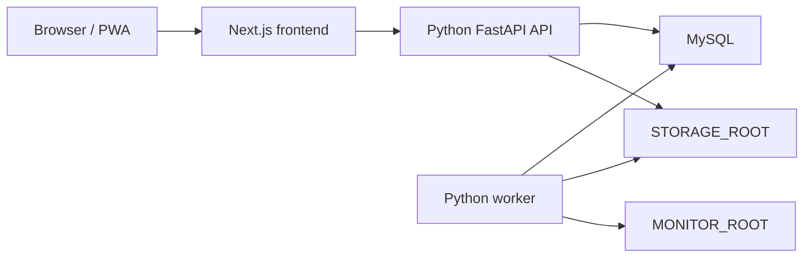

# Python Backend Migration Progress

This document tracks the migration from the current Node.js/Next.js backend implementation to an independent Python backend. The first implementation stage is intentionally additive: it introduces documentation and a standalone Python service without changing the existing Next.js, TypeScript, Docker Compose, or API routing behavior.

## Current Node Backend Inventory

- API surface: Next.js App Router routes under `apps/web/app/api`, currently 67 route files and roughly 87 HTTP handlers.
- Web backend libraries: shared TypeScript logic under `apps/web/lib`, including auth, health checks, file responses, backups, source search, downloads, reader preferences, and view mapping.
- Import and organization logic: TypeScript packages under `packages/scanner/src`, including EPUB/CBZ/ZIP import, comic page indexing, cover generation, path safety, metadata suggestions, and organize jobs.
- Worker: `workers/scan-worker` runs as a separate TypeScript process that watches monitor folders and creates import tasks.
- Database: Prisma Client against MySQL, with schema in `packages/database/prisma/schema.prisma`.
- Deployment: Docker Compose currently runs `web`, `scan-worker`, `migrate`, and `mysql`; production images are Node based.
- Storage: imported files, covers, indexes, temporary files, and logs live under `STORAGE_ROOT`; monitor folders are constrained by `MONITOR_ROOT`.
- Auth: cookie session named `shuku_session`, persisted `Session` rows, SHA-256 token hashes, and scrypt password hashes in `salt:hash` format.

## Target Architecture

- Frontend remains Next.js/React.
- Backend API becomes a separate Python FastAPI service.
- Background importing becomes a separate Python worker.
- MySQL remains the system of record.
- Existing `/api/...` paths remain the public contract.
- Unified `/api` routing is deferred until the Python API has compatible coverage.

## Technology Choices

- API framework: FastAPI, for typed request/response handling and OpenAPI support.
- ASGI server: uvicorn.
- ORM: SQLAlchemy 2.x.
- Migrations: Alembic.
- Configuration: pydantic-settings.
- Validation and serialization: Pydantic v2.
- File and import support: aiofiles, Pillow, ebooklib, lxml, Python stdlib zipfile, and either pypdfium2 or PyMuPDF.
- Worker: watchdog plus a standalone Python process.
- Tests: pytest and httpx.

## API Compatibility Rules

- Preserve public paths, methods, query parameters, request bodies, cookie names, and response shapes.
- Successful JSON responses use `{ "ok": true, "data": ... }`.
- Failed JSON responses use `{ "ok": false, "error": { "message": "...", "details": ... } }`.
- Auth keeps the existing `shuku_session` cookie and existing database-backed session semantics.
- File responses must preserve Range, ETag, Last-Modified, 206, 304, and 416 behavior.
- Python code must not import or execute TypeScript backend modules.
- Phase 1 must not modify existing Next.js/TypeScript runtime paths.

## Migration Phases

| Phase | Status | Goal | Completion standard |
| --- | --- | --- | --- |
| 0. Progress document | Initial complete | Track architecture, risks, stages, and capability status | This document exists and is updated as work lands |
| 1. Python backend skeleton | Initial complete | Add standalone FastAPI app, config, DB base, low-risk models, Alembic, tests | Health/auth skeleton tests pass under `apps/api-python` |
| 2. Compatible API implementation | In progress | Implement existing `/api` behavior in Python by capability area | Python route coverage now matches every current Next.js API route method; representative compatibility smoke tests pass |
| 3. Python worker | Not started | Replace monitor-folder import worker with Python implementation | Worker can import test EPUB/CBZ/ZIP/PDF data and write compatible DB/storage records |
| 4. Unified `/api` integration | Not started | Route frontend `/api` traffic to Python | Frontend works without changing fetch URLs and can be rolled back by route group |

## Capability Progress

| Capability area | Node source of truth | Python status | Notes |
| --- | --- | --- | --- |
| Health | `apps/web/app/api/health`, `apps/web/lib/system-health.ts` | Initial skeleton complete | Basic env, DB, monitor, storage checks with compatible response envelope |
| Auth | `apps/web/lib/auth.ts`, `apps/web/app/api/auth` | Initial skeleton complete | Cookie/session/password compatibility started for login, logout, and me |
| Dashboard | `apps/web/app/api/dashboard` | Initial compatible API complete | Summary, recent books, continue reading, and system status return compatible envelopes |
| Works / library | `apps/web/app/api/works`, `apps/web/lib/books.ts` | Initial compatible API complete | List/detail/update/delete/bulk/action routes exist with database-backed views and safe empty defaults |
| Reader | `apps/web/app/api/reader`, `apps/web/app/api/editions` | Initial compatible API complete | Preferences, progress, and bootstrap routes are implemented |
| Files and covers | `apps/web/lib/file-response.ts`, cover/page routes | Initial compatible API complete | File, edition file, cover, and page routes use FastAPI file responses; deeper Range/ETag parity remains a focused risk |
| Import | `apps/web/app/api/works/import`, `packages/scanner/src/managed-import.ts` | Initial compatible API complete | Upload endpoint queues compatible import task records; parser/storage parity remains worker phase work |
| Worker | `workers/scan-worker/src/index.ts` | Not started | Needs watchdog, task creation, import orchestration |
| Sources | `apps/web/app/api/sources`, `apps/web/lib/sources` | Initial compatible API complete | CRUD, test, search, search-record actions, and download-task creation routes exist; provider execution remains incremental |
| Downloads | `apps/web/app/api/download-tasks`, `apps/web/lib/downloads` | Initial compatible API complete | CRUD and lifecycle action routes are implemented; executor behavior remains incremental |
| Organize | `apps/web/app/api/organize`, `packages/scanner/src/organize-pipeline.ts` | Initial compatible API complete | Jobs, pending, detail, apply, refresh, and bulk-apply routes are implemented |
| Backups | `apps/web/app/api/backups`, `apps/web/lib/backup-service.ts` | Initial compatible API complete | List/create/download/delete/restore validation routes exist with documented non-destructive restore behavior |
| Settings | `apps/web/app/api/system-settings`, monitor folders | Initial compatible API complete | System settings and monitor-folder CRUD are implemented and smoke-tested |

## Current Python API Verification

- `apps/api-python/tests/test_route_coverage.py` compares every current `apps/web/app/api/**/route.ts` exported HTTP method with the FastAPI route table.
- `apps/api-python/tests/test_compat_api.py` smoke-tests representative authenticated API surfaces and mutation behavior.
- Latest local command: `uv run --extra dev pytest -q` under `apps/api-python` passes with 8 tests.

## Risks

- Data compatibility: SQLAlchemy models must match the Prisma-managed MySQL schema exactly before writing production data.
- File streaming: reader behavior depends on precise byte-range and cache semantics.
- Import parity: EPUB/CBZ/PDF parser differences can change metadata, page order, cover selection, and dedupe behavior.
- Worker races: monitor folder import must preserve duplicate handling and failure recovery.
- Deployment split: adding a Python API changes process boundaries, health checks, logs, and production rollback strategy.
- Partial migration: until unified routing is enabled, Python API development must avoid drifting from the current contract.

## Immediate Next Steps

1. Expand SQLAlchemy models from low-risk auth/settings tables toward library read models.
2. Build contract tests from current frontend API expectations before enabling any `/api` routing change.
3. Implement the next low-risk API batch: dashboard summary, system settings, monitor folders, and reader preferences.
4. Keep unified `/api` routing disabled until Python coverage is broad enough for route-group cutover.
