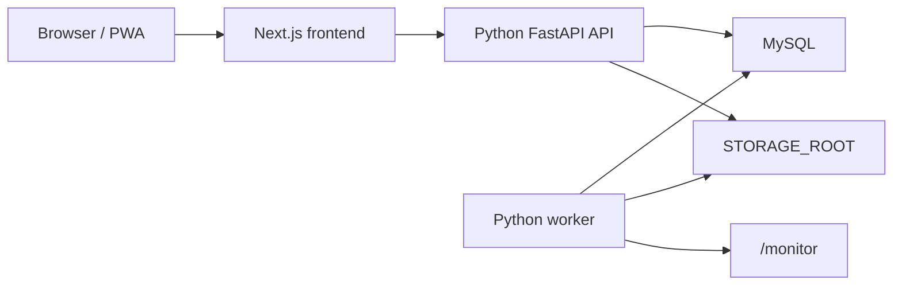

# Python Backend Runtime

Shuku Starship now uses Python as the backend runtime. The Next.js app is only the React frontend and an internal `/api/*` rewrite target.

## Runtime Boundaries

- Frontend: `apps/web` renders pages and calls `/api/...`.
- API: `apps/api-python/app/main.py` serves all public API routes through FastAPI.
- Worker: `apps/api-python/app/worker` handles monitor-folder importing.
- Database schema initialization is owned by Python API startup; there is no separate migrator container.
- Next.js API route handlers under `apps/web/app/api` have been removed.
- TypeScript scanner/import/organize backend code under `packages/scanner` has been removed.

## Verification

- `apps/api-python/tests/test_route_coverage.py` asserts that Next.js API routes are absent.
- `apps/web/lib/next-config-rewrites.test.ts` verifies that `/api/:path*` is rewritten to `http://127.0.0.1:8000`.
- `scripts/verify-python-backend-migration.mjs` runs Python tests, runtime smokes, frontend typecheck/tests, and Compose topology checks.

## Operational Notes

- The unified `web` container starts Next.js, FastAPI, and the Python worker with `scripts/start-unified-app.sh`.
- Production Compose exposes only `web` and `mysql`.
- The public `/api/...` contract is owned by Python. New backend behavior should be added under `apps/api-python`, not `apps/web`.
